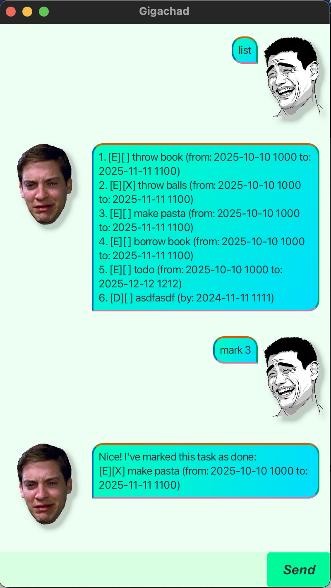

# Gigachad User Guide
Gigachad, a handsome personal task manager!


# Features

## Feature 1: Adding tasks

### Types of tasks:
1. Todos
2. Deadlines
3. Events

### Usage:
1. Todo: `todo <description>`
2. Deadline: `deadline <description> /by <DateTime>`
3. Event: `event <description> /from <DateTime> /to <DateTime>`
>Remember to use DateTime in the following format: **yyyy-MM-dd HHmm**

## Feature 2: Listing existing tasks

Usage: `list`

Example output:
``` 
Here are the tasks in your list: 
    1. [T][] throw rubbish
    2. [D][X] submit assignment (by: 2024-11-11 1200)
    3. [E][ ] make pasta (from: 2025-10-10 1000 to: 2025-11-11 1100)
```

## Feature 3: Deleting tasks

Usage: `delete <taskNumber>`

Example usage: `delete 2`
> Deletes task "2." from your `list`

## Feature 4: Mark/Unmark task as done

Usage:
* `mark <taskNumber>`
* `unmark <taskNumber>`

Example usage:
* `mark 2`
> Marks task "2." from your `list` as complete

* `unmark 2`
> Unmarks task "2." from your `list` as complete

## Feature 5: Find task

Usage: `find <keyword>`

Example usage: `find meet`
> Gigachad will output all tasks that contains the keyword "pasta" <br>
> i.e. only task 3 from the above example

## Feature 6: help

Usage: `help`

Example output:

```markdown
To add todos: todo <task>
To add deadlines: deadline <task> /by <due date>. Format: yyyy-MM-dd HHmm
To add events: event <task> /from <start> /to <end>. Format: yyyy-MM-dd HHmm
To list all your todos: list
To mark your todos as complete: mark <task number (find using list)>
To unmark your todos as complete: unmark <task number (find using list)>
To delete your todos: delete <task number (find using list)>
To search for todos with keywords: find <keyword>
To exit: bye 
```

## Feature 7: Exit app

Usage: `bye`
> This will exit the app!